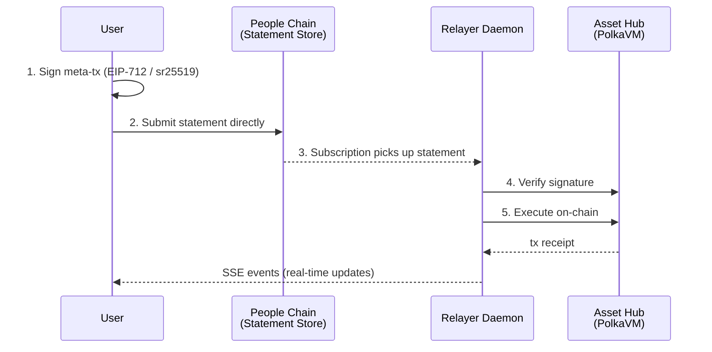
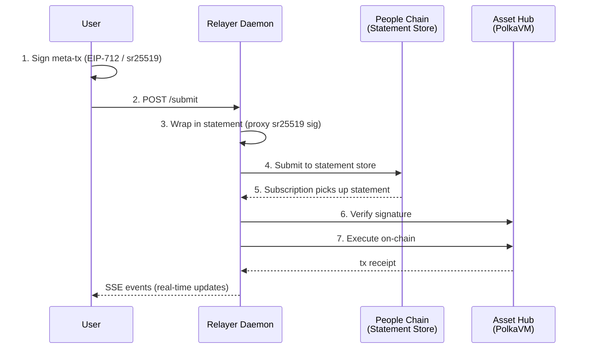

# Sponsored Meta-Transactions on Preview Net

Mint free NFT event tickets on Polkadot's Asset Hub (Preview Net) without holding native tokens. A relayer daemon pays gas on behalf of users using **EIP-2771 meta-transactions**, transported via the **People Chain Statement Store** (P2P gossip).

Supports both **MetaMask (EVM/ECDSA)** and **Polkadot wallets (sr25519)**.

## Architecture

There are two submission paths depending on whether the user has a People Chain attestation (statement store allowance):

**Path A — Direct submission (attested users):**



**Path B — Proxy fallback (unattested users, e.g. MetaMask):**



The frontend attempts Path A first for Polkadot wallets, falling back to Path B on failure. MetaMask always uses Path B.

> **Note on Path A:** Path A (direct statement submission) may fail with `badProof` for browser wallets due to the `<Bytes>` wrapping that wallet extensions apply to `signRaw`. When this happens, the frontend automatically falls back to Path B. The mint authorization signature avoids this issue by pre-wrapping the message with `<Bytes>...</Bytes>` (matching the `SubstrateForwarder` contract's `_buildMessage`) and signing with `type: 'payload'`.

**Contracts (3 total):**
- `ERC2771Forwarder` — OpenZeppelin v5. Verifies EIP-712 signatures, manages nonces, forwards calls.
- `SubstrateForwarder` — Custom forwarder for sr25519 signatures (Polkadot native wallets).
- `TicketNFT` — Custom ERC-721 with `ERC2771Context`. Soulbound, 1 mint per address, supply cap, deadline.

**Transport:** People Chain Statement Store — a decentralized P2P gossip layer. No single relay server dependency.

## Quick Start

### 1. Install dependencies

```bash
npm install
```

### 2. Configure environment

```bash
cp .env.example .env
# Edit .env with your deployer private key and contract addresses
```

### 3. Compile & test

```bash
npm run compile
npm test
```

### 4. Deploy to Preview Net

```bash
npm run deploy:preview
# Copy the output addresses into .env (FORWARDER_ADDRESS, SUBSTRATE_FORWARDER_ADDRESS, TICKET_NFT_ADDRESS)
```

### 5. Start the relayer daemon

```bash
npm run relayer
```

The daemon:
- Connects to People Chain and subscribes to the statement store
- Exposes `/submit` (Path B proxy), `/events` (SSE), and `/health` on port 3001 (configurable via `DAEMON_PORT`)
- Broadcasts SSE events for real-time lifecycle tracking

### 6. Open the developer dashboard

```bash
npm run frontend
# Opens http://localhost:8080
```

Or open `frontend/index.html` directly — it's self-contained (config, nonces, contract calls all happen client-side). Add `?daemon=http://localhost:3001` to connect to the daemon for `/submit` (Path B proxy) and `/events` (SSE stream).

The dashboard shows:
- System info (contract addresses, RPC, People Chain)
- Wallet connect (MetaMask or Polkadot wallet, with account picker)
- 5-step transaction pipeline (Signed → Submitted → Picked Up → Executed → Confirmed)
- Live event log with daemon SSE traffic

## Project Structure

| File | Purpose |
|------|---------|
| `contracts/TicketNFT.sol` | NFT contract with ERC2771Context |
| `contracts/SubstrateForwarder.sol` | Forwarder for sr25519 meta-transactions |
| `contracts/ForwarderImport.sol` | Forces Hardhat to compile the OZ forwarder |
| `lib/statement-store.ts` | People Chain client, proxy signer, statement encode/decode |
| `scripts/relayer-daemon.ts` | Relayer daemon — statement store subscriber, tx sponsor, `/submit` proxy |
| `scripts/deploy-preview.ts` | Deploy contracts to Preview Net |
| `scripts/register-proxy.ts` | One-time proxy account registration on People Chain |
| `scripts/test-mint.ts` | End-to-end integration test |
| `frontend/index.html` | Self-contained developer dashboard (only needs daemon for `/submit` + `/events`) |
| `server/index.ts` | Legacy Express relay server (pre-statement-store) |
| `test/TicketNFT.test.ts` | Unit tests |

## Daemon API

| Method | Path | Description |
|--------|------|-------------|
| `POST` | `/submit` | Submit a meta-tx (daemon wraps it in a statement via proxy) |
| `GET` | `/events` | SSE stream — real-time lifecycle events |
| `GET` | `/health` | Health check (relayer address, balance, proxy, processed count) |

### SSE Events

| Event | When |
|-------|------|
| `statement:submitted` | Meta-tx wrapped and submitted to People Chain |
| `statement:received` | Subscription picks up a new statement |
| `tx:verifying` | Signature verification in progress |
| `tx:submitted` | Transaction sent to Asset Hub |
| `tx:confirmed` | Transaction confirmed on-chain |
| `tx:failed` | Error at any stage (whitelist, deadline, verify, revert) |
| `daemon:health` | Heartbeat every 30s (balance, processed count, queue) |

All events carry a `correlationId` (`type:from:deadline`) for tracking a specific transaction through the pipeline.

## Anti-Spam Layers

| Layer | Mechanism | Where |
|-------|-----------|-------|
| 1 | Target contract whitelist | Daemon |
| 2 | Deadline expiry check | Daemon |
| 3 | Statement dedup (processed set) | Daemon |
| 4 | EIP-712 / sr25519 signature verification | Forwarder (on-chain) |
| 5 | hasMinted (1 per address) | TicketNFT (on-chain) |
| 6 | maxSupply cap | TicketNFT (on-chain) |
| 7 | mintDeadline | TicketNFT (on-chain) |
| 8 | Soulbound (non-transferable) | TicketNFT (on-chain) |

## Deployment

The daemon and frontend are separate services:

- **Daemon:** Runs as a background service (e.g. on Railway, a VPS, etc.). Only exposes `/submit`, `/events`, `/health`.
- **Frontend:** Static HTML — serve from any static host (GitHub Pages, Vercel, Netlify, `npx serve frontend`, or just open `index.html` locally).

### Daemon (Railway example)

1. **Install Railway CLI and login:**
   ```bash
   npm i -g @railway/cli
   railway login
   ```

2. **Initialize project** (from repo root):
   ```bash
   railway init
   ```

3. **Set environment variables:**
   ```bash
   railway variables set DEPLOYER_PRIVATE_KEY=<your-key>
   railway variables set FORWARDER_ADDRESS=<address>
   railway variables set SUBSTRATE_FORWARDER_ADDRESS=<address>
   railway variables set TICKET_NFT_ADDRESS=<address>
   railway variables set PEOPLE_WS_URI=wss://previewnet.substrate.dev/people
   railway variables set ASSET_HUB_ETH_RPC=https://previewnet.substrate.dev/eth-rpc
   railway variables set PROXY_SEED=<seed>
   ```
   Do not set `PORT` — Railway assigns it automatically.

4. **Deploy:**
   ```bash
   railway up
   ```

5. **Generate a public domain:**
   ```bash
   railway domain
   ```

### Frontend

Serve the `frontend/` directory from any static host. Point it at the daemon with the `?daemon=` query parameter:

```
https://your-frontend.example.com?daemon=https://your-daemon.railway.app
```

For local development: `npx serve frontend -l 8080` and open `http://localhost:8080?daemon=http://localhost:3001`.

## Network

- **Chain:** Preview Net Asset Hub
- **RPC:** `https://previewnet.substrate.dev/eth-rpc`
- **People Chain WS:** `wss://previewnet.substrate.dev/people`
